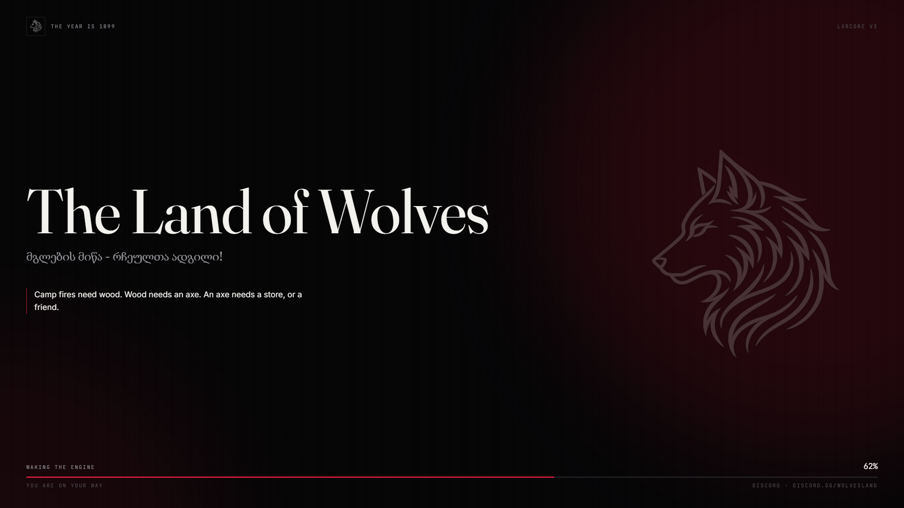

# lxr-loading — the loading screen for LXRCore v3


What the player sees between *Connect* and the character room: the wolf, the
server's name and tagline from the brand convars, a line of the land, and a
progress bar fed by the game's own load events. No music, no third-party
assets, no build step.



## How it works

* `loadscreen 'html/index.html'` with a manual shutdown: the page is up from the
  first frame; the client script sends the brand (`sv_projectName`, `lxr_tagline`,
  `lxr_discord` through `LXRCore.Brand`) and the locale as soon as it starts.
* Progress comes from the game (`loadProgress`), the phase line from the init
  stages (`INIT_BEFORE_MAP_LOADED` → *Waking the engine* … `INIT_SESSION` →
  *Finding the others*).
* `Config.Hide.mode = 'session'` (default): the screen fades once the network
  session is up and the game has a ped — the character room opens right after,
  so the world is never seen. `'event'`: it stays until `lxr-loading:client:hide`
  (or `exports['lxr-loading']:Hide()`), with a timeout as the safety net.
* Lines rotate every `Config.Lines.everySeconds`, shuffled; add more under
  `lines.*` in `locales/`.

## Install

```cfg
ensure lxr-core
ensure lxr-nui
ensure lxr-loading
```

> © 2026 iBoss21 / LXRCore | [lxrcore.com](https://www.lxrcore.com) | All Rights Reserved
